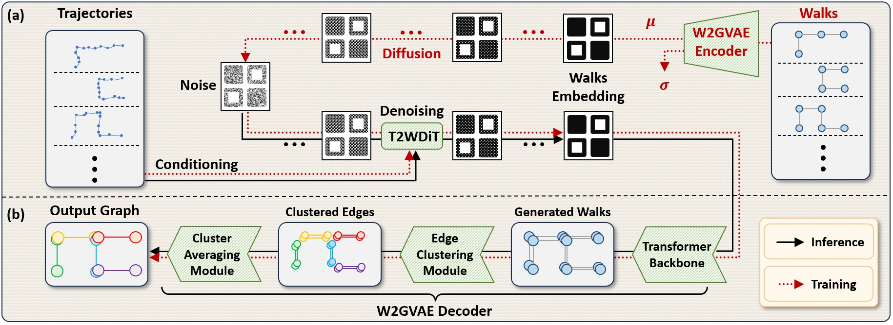

# GraphWalker

Road network generation.

## Environment setup
The versions of the packages do not need to match exactly, but the code was implemented with the following versions:
- Python 3.11
- PyTorch 2.1.0
- NumPy 1.26.4
- scipy 1.11.4
- matplotlib 3.8.2
- networkx 3.0

You need OSMnx package to download the map data, which requires a new environment setup. You can follow the instructions on the [OSMnx Documentation](https://osmnx.readthedocs.io/en/stable/).

## Directories
- `Dataset`: Contains the dataset class for the road network data, and also some code for simple dataset generation. (For the diffusion-based trajectory generation, please refer to [Control Traj](https://arxiv.org/abs/2404.15380)).
- `Diffusion`: Contains the model class for the graph walker model.
- `Models`: Contains the neural network model classes.
- `Runs`: Stores the model checkpoints and the training logs.
- `TrainEvalTest`: Contains the training and testing scripts.

## Model Architecture
> Note that we are keep ***improving*** the model, so you can expect some ***mismatch*** between the paper and the code. However, we assure you that we will ***NOT*** make big changes on the overall architecture. The ***end-to-end learnable transition of Trajs-Walks-Graph*** will persist.
> 

## Usage
- `Training`: Run the train.py file to train the model. Adjust hyperparameters in the train.py file.
- `Testing`: Run the test.py file to test the model. Adjust hyperparameters in the test.py file.
- `Dataset Generation`: First, you should download the road network data using Dataset/getGraphml.py.Then, run the Dataset/processGraphml.ipynb file to complete stage 1. Next, run the processNumpyAndImage.ipynb file to complete stage 2. This will result in a dataset.pt file, which can be loaded by Dataset/RoadNetworkDataset.py.
